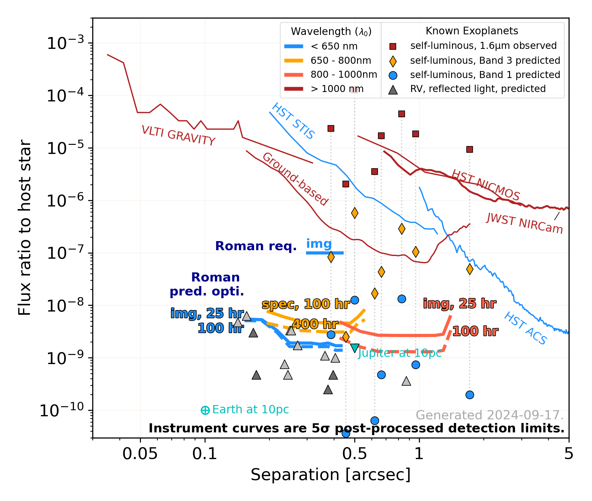

# Roman CGI performance in context

[comment]: # (Edits and additions welcome! If applicable, also update [1] the repository README, [2] the short caption header of the corresponding data files, [3] use doc.yml to update flux_ratio_doc.png)

[comment]: # (This .md file is compatible with the Pandoc PDF generator. Pandoc PDF uses LaTeX, so please do not use characters that are not recognized by LaTeX. Write any symbols as they'd appear in LaTeX. eg: use $\sigma$ ΝΟΤ σ. Unfortunately, Github doesn't include a math interpreter, so you'll just see the verbatim text online.)

The Coronagraph Instrument (CGI) for NASA’s Wide Field Infrared Survey Telescope (Roman) will constitute a dramatic step forward for high-contrast imaging, integral field spectroscopy, and polarimetry of exoplanets and circumstellar disks, aiming to improve upon the sensitivity of current direct imaging facilities by two orders of magnitude or more. Furthermore, CGI will serve as a pathfinder for future terrestrial planet-imaging missions by demonstrating wavefront control, coronagraphy, and spectral retrieval in a new contrast regime, and by validating instrument and telescope models at unprecedented levels of precision. In this document, we present a “Roman in context” plot and describe the data and assumptions used to generate it.

_Figure 1:_ Predicted Roman performance in the context of known planets and existing and planned high-contrast instruments. The y-axis indicates the flux ratio between a planet and its host star (for individual planets) or between the star and the dimmest source detectable at 5$\sigma$ after post-processing (for instrument performance curves). The lower x-axis is projected separation in arcseconds, and the upper x-axis is the corresponding physical separation for the Tau Ceti system. Points and lines are color-coded by wavelength of observation. Solid and dashed lines are 5-sigma point source detection limits versus separation from the host star; these limits are calculated from post-processed data. The predicted performance for the future observatory, JWST, is plotted as a dashed line. Line labeled "Roman CGI req" is the Level 1 preformance  requirement. Lines labeled "Roman CGI pred." are current best performance predictions 
(see [Performance Predictions](#performance_predictions)). Triangular points are estimated reflected light flux ratios for known gas giant radial velocity-detected (RV). Red squares are 1.6$\mu m$ flux ratios of known self-luminous directly-imaged (DI) planets. Dotted lines connect each DI planet’s measured 1.6$\mu m$ flux ratio to its predicted flux ratio at 750nm (yellow diamonds) or 550nm (blue circles), based on COND or BT-Settl planet evolutionary models. Cyan points represent the reflected light flux ratios of Earth and Jupiter at 10pc as well as super-Earths Tau Ceti e and f.

## Flux Ratio

For individual planets, “flux ratio” is the ratio of the planet flux to the flux of the host star in a particular bandpass. For instrument detection limits, it is the ratio of the flux of the dimmest source detectable at 5$\sigma$ to the flux of the host star. This curve describes the sensitivity of the instrument to faint sources as a function of separation from the host star, for a particular bandpass. All instrument curves presented here are 5$\sigma$ final point source detection limits, derived from post-processed data.

## Known planets

### RV-detected planets in reflected light

Two options are available for flux ratio predictions.

#### Simple Lambertian model

The reflected light planets include of all radial velocity-detected planets from the NASA Exoplanet Archive with projected semi-major axis of 0.14” - 1.2”, $M sin(i) > 0.25 M_{Jup}$, and host star Vmag < 7.
Note that CGI is required to achieve optimal performance only for Vmag < 5.
The flux ratio was calculated using a Lambertian model with the following assumptions: radius = 1 $R_{Jup}$, geometric albedo = 0.5, and planet viewed at quadrature.
The flux ratios for the Super-Earths Tau Ceti e and f assume: Lambertian model, radius = $( M / M_E )^{1/3}  R_E$, Earth-like geometric albedo = 0.35, and viewed at quadrature.
The flux ratio for Earth is fixed at 1E-10. The flux ratio for Jupiter assumes a Lambertian model with albedo of 0.52, viewed at quadrature. We place Earth and Jupiter at apparent separations corresponding to a system distance of 10pc.
_Caveat:_ Orbital eccentricity is ignored; all planets are placed a a separation equal to their semi-major axis.

References: Equations 14 & 15 and table 3 of Traub & Oppenheimer (p. 116 of the Seager “Exoplanets” textbook).

#### Imaging Mission Database model

The Imaging Mission Database (IMD; plandb.sioslab.com) provides calculated flux ratios at quadrature for known RV planets in the Roman CGI bandpasses. The IMD draws the mass and orbit properties of known radial velocity exoplanets from the NExScI Exoplanet archive. If the planet radius has not been measured directly, IMD calculates it with a modified version of the Forecaster model to predict planet radius (not to exceed 1 Jupiter radius for cold planets). It uses Batalha2018 models to predict phase curves; the nearest neighbor grid is selected for stellar metallicity and orbit semi-major axis. We assume clouds with $f_{sed} = 3$.  Dark gray triangles signify V < 5 host stars; light grey triangles signify 5 < V < 6 host stars.

See https://plandb.sioslab.com/about.php for acknowledgement and citation information.  As of March 2020, the following are required:

The publication/presentation must include the following statement of acknowledgement: "This research has made use of the Imaging Mission Database, which is operated by the Space Imaging and Optical Systems Lab at Cornell University. The database includes content from the NASA Exoplanet Archive, which is operated by the California Institute of Technology, under contract with the National Aeronautics and Space Administration under the Exoplanet Exploration Program, and from the SIMBAD database, operated at CDS, Strasbourg, France "

Any manuscript/poster must cite the following works:

* Wenger et al. (2000) "The SIMBAD astronomical database."
* Batalha et al. (2018) "Color Classification of Extrasolar Giant Planets: Prospects and Cautions."
* Turnbull M. (2015) "ExoCat-1: The Nearby Stellar Systems Catalog for Exoplanet Imaging Missions"

The authors of any paper submitted for peer reviewed journal publication must extend an invitation of authorship to the people listed below. Such opt-in requests must be acknowledged in a timely fashion (no more than one month after the first email/contact) and it is up to the paper first author to determine the appropriate author order. Authors of conference proceedings papers, presentations, and posters do not need to extend authorship invitations, but must still conform to the first two stipulations.

* Dmitry Savransky (ds264@cornell.edu)
* Nikole Lewis (nkl35@cornell.edu)
* Bruce Macintosh (bmacintosh@stanford.edu)
* Natasha Batalha (nbatalha@ucsc.edu)
* Mark Marley (Mark.S.Marley@nasa.gov)

### Directly imaged self-luminous planets

Selected known self-luminous Directly Imaged (DI) exoplanets with measured H-band flux ratios are plotted. Where available, predictions from B. Lacy were used. Otherwise, for those planets with effective temperatures <=1200K, we use AMES-COND models; for the remainder, we use BT-Settl. For all COND/BT values, we assume log(g)=4.0, and we use NextGen stellar models to predict the colors of the host stars at the same wavelengths. From the star and planet color information, we then calculate the expected flux ratio of the planets. For expediency, for COND/BT values, we use WFC3 filters that approximate Roman bands: F547M (12%) and F763M (11%), because WFC3 colors were pre-calculated for each of the three model grids.

Models are available at https://phoenix.ens-lyon.fr/Grids/

Lacy models are described at https://ui.adsabs.harvard.edu/abs/2019arXiv191110585L/abstract

## Roman CGI mission concept predicted detection limits

### CGI requirement, labeled “CGI req.” in the figure

* **Description**: Level 1 requirement (Threshold Technology Requirement 5). Roman shall be able to measure (using CGI), with SNR >= 5, the brightness of an astrophysical point source located between 6 and 9 lambda/D from an adjacent star with a $V_{AB}$ magnitude <= 5, with a flux ratio >= $1 10^{-7}$; the bandpass shall have a central wavelength <= 600 nm and a bandwidth >= 10%.
* **Bandpass:** 575nm / 10% BW, Hybrid Lyot coronagraph
* **Integration time:** Not specified
* **Post-processing:** The requirements are written for post-processed data; no method is specified.
* **Reference:** KDP-C PLRA, Feb. 2020

### Performance predictions :
* **Description**: Model-predicted 5$\sigma$ final detection limits for a V=5 G0V star in the three official observing modes. Model uncertainty factors (MUFs) for observatory and CGI set to unity. No performance margins. Incorporate results from OS9, with further updates to CGPERF tables, bench warping and DM temperature stability, and coating reflectivity. (Feb 1, 2021 spreadsheet version) 
* **Bandpass:**
    * narrow FOV imaging : 575nm / 10% BW, Hybrid Lyot coronagraph.
    * spectroscopy : R=50 spectroscopy, 730nm / 15% BW, Shaped Pupil bowtie coronagraph.
    * wide FOV imaging : 825nm / 10% BW, Shaped Pupil wide field of view coronagraph.
* **Integration time:**
    * imaging : 25, 100, 10000hr ('infinite' time)
    * spectroscopy : 100, 400, 10000hr
* **Post-processing:** Reference PSF subtraction, with an assumed additional factor of 2 improvement over the basic-RDI residual speckle component, from the application of more sophisticated post-processing techniques.
* **Reference:** B. Kern & B. Nemati spreadsheet, personal communication.

### Old CGI Tech Demo requirements.

Labeled "old L2 req." in figure if enabled.

* **Description**: OLD (Phase B) Level 2 requirements for narrow FOV imaging, spectroscopy, and wide FOV imaging. Removed from Mission Requirements Document in February 2020, but kept here for historical completeness. All requirements were written for SNR=10 detections; the plotted curves are divided by 2 to yield SNR=5.
* **Bandpass**:
    * narrow FOV imaging : 575nm / 10% BW
    * spectroscopy : 730nm / 15% BW
    * wide FOV imaging : 825nm / 10% BW
* **Integration time:**
    * narrow FOV imaging : 10hr
    * spectroscopy : 100hr
    * wide FOV imaging : 24hr
* **Post-processing**: The requirements are written for post-processed data; no method is specified.
* **Reference**: OLD (Phase B) L2 requirements CGI-TECH-1, 2, 3. Removed from Mission Requirements Document in February 2020.

## Other Instruments

### HST NICMOS
* **Description:** Best 5$\sigma$ final detection limit curve from the ALICE re-analysis of NICMOS archival coronagraphic imaging  data (HST program 7226, and others)
* **Bandpass:** F160W
* **Integration time:** typically 2hr per target (600s – 1600s range)
* **Post-processing:** KLIP (Karhunen–Loève Image Processing) using Reference Differential Imaging (RDI) and match filtering.
* **References:**
    * E. Choquet, personal communication.
    * More information about the ALICE program can be found in [Choquet et al, Proc. SPIE 9143, 914357 (2014)](http://adsabs.harvard.edu/abs/2014SPIE.9143E..57C).

### HST STIS
* **Description:** 5$\sigma$ final detection limit curve from observations of HD 38393 with the Bar5 coronagraph (HST program 14426)
* **Bandpass:** No filter was used, and so the bandpass is governed by the detector, approximately 200-1030nm.
* **Exposures:** 9 roll angles with 9 dithers per roll angle. A total of 810, 0.2sec images were taken, for a total integration time of 2.7 minutes.
* **Post-processing:** KLIP algorithm
* **Other notes:** Due to the short integration time, the curve is moderately photon limited at large angles. Based on the “photon limit” curve presented in the paper, and assuming that photon noise adds in quadrature with speckle noise to produce the KLIP detection limit, the photon noise is >50% the amplitude of the speckle noise beyond ~0.7”.
* **References:**
    * [Rin et al, Proc. SPIE 10400, 1040021 (2017)](http://adsabs.harvard.edu/abs/2017arXiv170910125R)
    * [STIS Bar5 handbook](http://www.stsci.edu/hst/stis/strategies/pushing/coronagraphy_bar5)

### HST ACS
* **Description:** 5$\sigma$ final detection limit curve from observations of Arcturus with the 1.8" coronagraph
* **Bandpass:** F606W
* **Exposures:** 2x100sec images, taken 85 minutes apart, to simulate a typical 2-roll (2 orbit) Angular Differential Imaging (ADI) observation.
* **Post-processing:** Simple difference of the two images.
* **Reference:** J. Krist, personal communication.

### VLT SPHERE
* **Description:** 5$\sigma$ final detection limit curve from observations of Sirius with the IFS and IRDIS instruments
* **Bandpass:** At separations <0.7" the curve is from the IFS instrument at broadband YJH; at >0.7” the curve is from the IRDIS instrument at K12-band. The 0.7” is the crossover point is where IRDIS becomes more sensitive than IFS.
* **Integration time:** IRDIS = 88min total, IFS = 59min total. The data were taken concurrently; the difference in integration time is due to different detector overheads. The field of view rotation during these observations was 106dgr.
* **Post-processing:** Spectral Differential Imaging, assuming the planet-star flux ratio is constant at all wavelengths.
* **Reference:** [Vigan et al. 2015 MNRAS 454 129](http://adsabs.harvard.edu/abs/2015MNRAS.454..129V)

### Gemini GPI
* **Description:** 5$\sigma$ final detection limit curve from observations of Sirius with the GPI IFS
* **Bandpass:** H-band
* **Integration time:** Original sequence was 11min integration time on target. The plotted curve is scaled by sqrt(11/60) to approximate the expected performance in a 1hr integration. This 1/sqrt(t) scaling has been verified for separations beyond 0.4” using a 4hr dataset from a different target; the scaling has not been tested for separations <0.4”.
* **Post-processing:** KLIP and Forward Model Matched Filtering, optimized for L-type planets
* **References:**
    * B. Macintosh & J. Chilcote, personal communication
    * [Ruffio, et al., ApJ 842, 14 (2017)](http://adsabs.harvard.edu/abs/2017ApJ...842...14R)

### Magellan VisAO
* **Description:**  5$\sigma$ final detection limit curve from observations of Alpha Cen [Beta Pic]
* **Bandpass:** i’ [Ys]
* **Integration time:** 440 min [120 min]. The plotted curve is scaled by sqrt(t/60) to approximate the expected performance in a 1hr integration.
* **Post-processing:** Angular Differential Imaging & KLIP
* **References:** J. Males, personal communication

### JWST NIRCAM prediction
* **Description:** Model-predicted 5$\sigma$ final detection limit curve.
* **Bandpass:** F210M
* **Exposures:** 2x1hr rolls (+5/-5dgr), with a 10mas pointing uncertainty and a 10nm differential WFE.
* **Post-processing:** Simple difference of the two images.
* **Other notes:** MUFs are uncertain; current practice is to use standard MUFs for the observatory and and MUF=1 for the instrument.
* **References:**
    * [Beichman et al, PASP 122, 162 (2010)](http://adsabs.harvard.edu/abs/2010PASP..122..162B)
    * [NIRCam Coronagraphic Imaging Handbook](https://jwst-docs.stsci.edu/display/JTI/NIRCam+Coronagraphic+Imaging)

### HabEx mission concept goal
* **Description:** Goal for HabEx 5$\sigma$ final detection limit (4E-11).
* **Bandpass:** 450nm at the inner working angle and 1micron at the outer working angle
* **Post-processing:** Algorithm not yet determined, but goal assumes post-processing gains a factor of 10 over raw image detection limits.
* **Reference:** B. Mennesson, personal communication

### ELT goal
* **Description:** Approximate region of parameter space that might be probed by ELTs
* **Bandpass:** TBD. NIR and perhaps visible.
* **Post-processing:** PSF-subtracted, algorithm TBD

## Authorship & Acknowledgements
Vanessa Bailey, Jet Propulsion Laboratory, California Institute of Technology

This work was carried out in part at the Jet Propulsion Laboratory, California Institute of Technology, under a contract with the National Aeronautics and Space Administration. Government sponsorship acknowledged.
